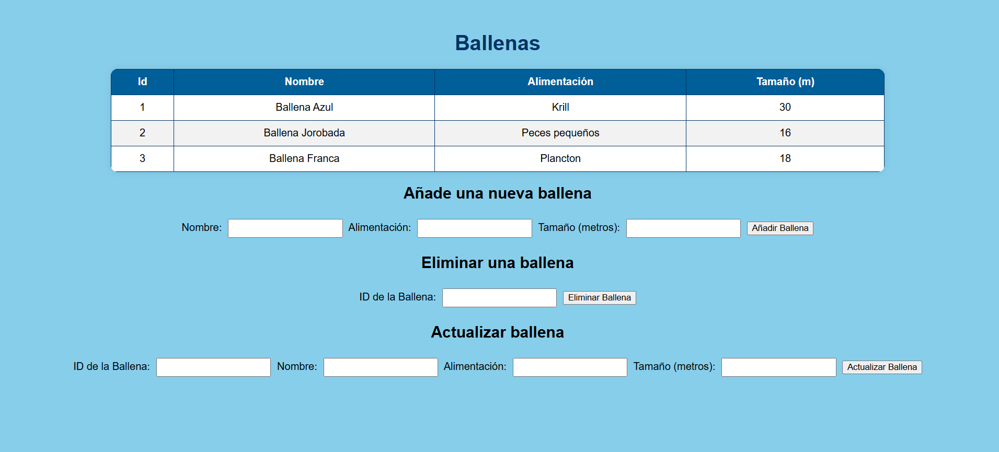
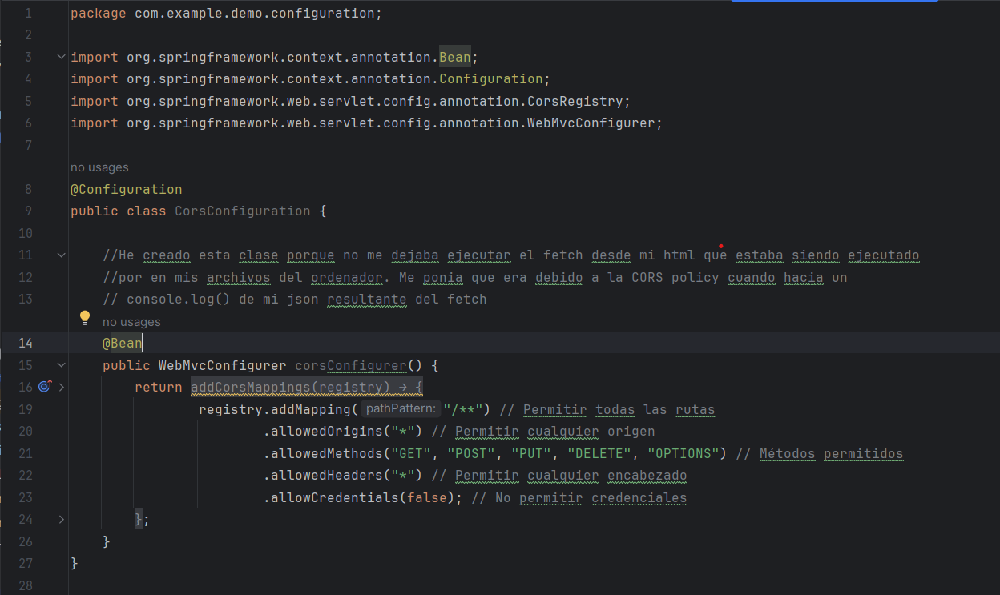

Practica 4  

En este repositorio podrás encontrar una carpeta con todas archivos utilizados para la creación de la API mediante el framework Spring Boot, y otra carpeta con los archivos utillizados para la creación de la página web
La página consiste en una tabla que contiene distintos tipos de ballenas, con unas características de dichas ballenas. La información de las ballenas es recogida através de la herramienta fetch a la API que 
ha sido creada, mediante el método GET. El usuario tendrá la opción de añadir un nuevo tipo de ballena a la tabla (POST), borrar una ballena indicando el id de la ballena a borrar (DELETE), y actualizar la información
de alguna ballena de la tabla, indicando también el id y la nueva información de la ballena (PUT).

La arquitectura utilizada durante la práctica, que separa el frontend del backend, asegura la escalabilidad del proyecto asi como la seguridad. 
El sistema de controlador que ofrece springboot, en el que se intercambia la información en formato de JSON y la comodidad de responder a las principales peticiones REST, compaginan muy bien con la forma de hacer
la página web con el html y el javascript.

Uno de los retos que enfrenté en el transcurso de la práctica fueron unos problemas con el CORS policy. El problema con CORS (Cross-Origin Resource Sharing) surgió porque el navegador bloqueó las peticiones del frontend
al backend en Spring Boot (localhost:8080) debido a la política de seguridad Same-Origin Policy, que impide solicitudes entre diferentes orígenes. Para solucinoarlo se implementó una clase a java en la que se indicaba
que se permitiesen todo tipo de comunicaciones. 

La práctica ha permitido desarrollar una API REST con Spring Boot y conectarla a una interfaz web en HTML, CSS y JavaScript, aplicando una arquitectura frontend-backend bien estructurada. A través del uso de fetch(),
se logró la comunicación con la API para obtener, agregar y visualizar datos dinámicamente en una tabla. Además, se han abordado conceptos clave como CORS o seguridad en el backend.
Esta práctica ha consolidado el uso de tecnologías modernas para el desarrollo web y resaltó la importancia de la separación de responsabilidades entre el cliente y el servidor para mejorar la 
escalabilidad y el mantenimiento del proyecto.
